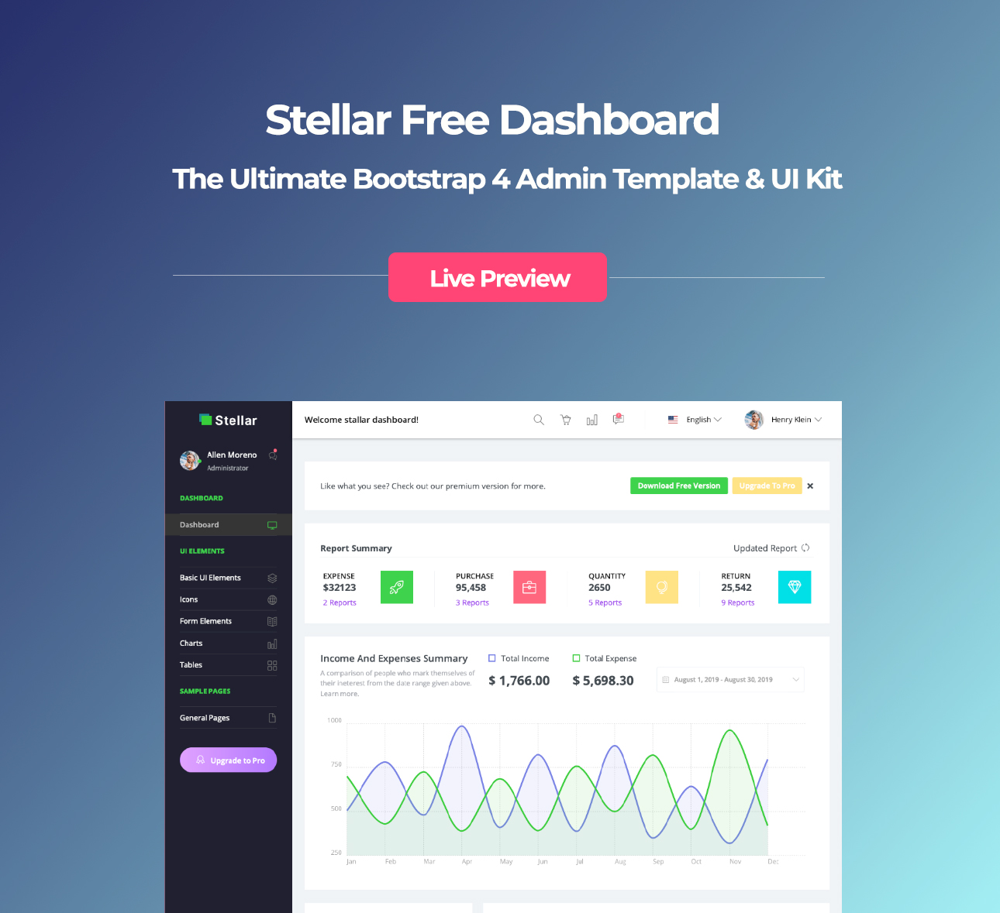

<h1>Stellar</h1>
Stellar admin template is completely based on the latest version of Bootstrap 4. Stellar Admin is designed to reflect the simplicity and svelte of the components and UI elements and coded to perfection with well-organized code. This makes it easy to change its looks to anything that you desire on your admin panel. Stellar Admin is a perfect pick to create any kind of simple or complex backend applications or any other web applications.
  
The template is always kept up to date and kept up with the latest technologies. Stellar is a completely responsive admin template that gives you an effortless viewing experience on mobile devices as well as small and large desktops.

<h1>Credits:</h1>

- Bootstrap 4
- Font Awesome
- jQuery
- Gulp
- Chart.js

<h1>Browser Support:</h1>

Stellar is designed to work flawlessly with all the latest and modern web browsers.

- Chrome (latest)
- FireFox (latest)
- Safari (latest)
- Opera (latest)
- IE10+  

<h1>License Information:</h1>

Stellar is released under MIT license. Stellar is a free Bootstrap 4 admin template developed from BootstrapDash. Feel free to download it, use it, share it, get creative with it.

<h1>How to use Stellar ?</h1>

1 - Click the Clone or Download button in GitHub and download as a ZIP file or you can enter the command git clone https://github.com/BootstrapDash/Stellar.git in you terminal to get a copy of this template.

2 - After the files have been downloaded you will get a folder with all the required files

3 - You can install all the dependencies in the template by running the command npm install. All the required files are in the node modules.

4 - Find the file named index.html, check what all components you need. Open the file in a text editor and you can start editing.

5 - Now that your project has now kick-started, all you need to do now is to code, code, and code to your heart's content.

<h1>How to Contribute?:</h1>

We love your contributions and we welcome them wholeheartedly. We believe the more the merrier.
To contribute make sure you have a Node.js and npm installed. Now run the command gulp --version. If the command returns with the Gulp version number, it means you have Gulp installed. If not you need to run the command npm install --global gulp-cli to install Gulp.

<h2>Next</h2>

After Gulp has been installed, follow the steps below to contribute.
   
	1 - Fork and clone the repo of Stellar.
   
	2 - Run the command npm install to install all the dependencies.
   
	3 - Enter the command gulp serve. This will open Stellar in your default browser.
   
	4 - Make your valuable contribution
   
	5 - Submit a pull request.

Do you need a template with more features and functionalities? Get more with our collection of the premium template with more plugins, eye catching animations, UI components, and sample pages all fitting together with a high-quality design.
Visit
  <a href="https://www.bootstrapdash.com" target="_blank">https://www.bootstrapdash.com</a> for more admin templates.
